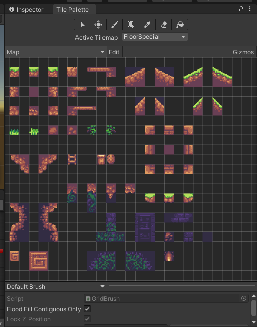
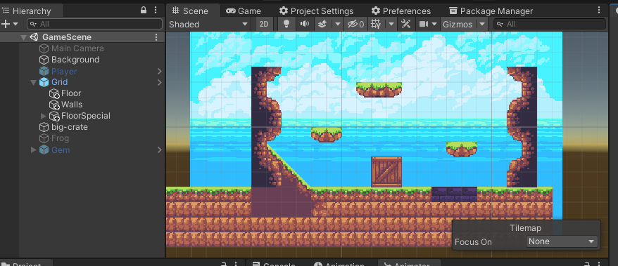
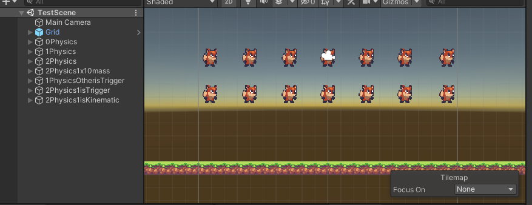
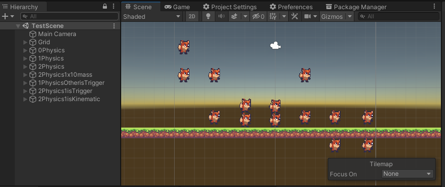
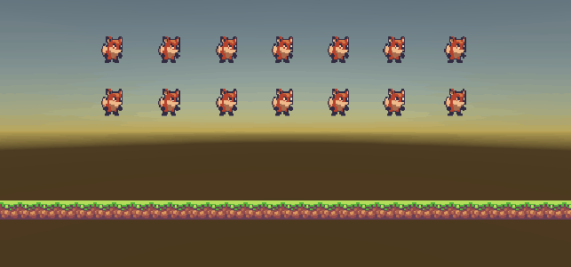
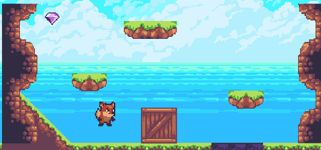
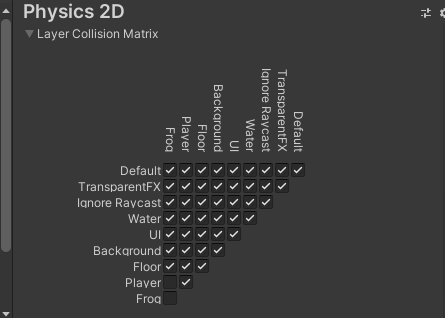

## 1. Obtener assets que incorpores a tu proyecto para la generación de un mapa plano

Para esto se usan los mismos assets de la práctica anterior de sprites, ya que también dispone de sprites para hacer un mapa en 2D.

## 2. Incorporar los recursos del punto 1 en el proyecto y generar al menos 2 paletas

Se ha generado 1 sóla paleta debido a las limitaciones de los recursos escogidos.

## 3. Generar un mapa convencional, incluir obstáculos y paredes.

Se ha generado un mapa con algunos obstáculos, plataformas y paredes. Se ha usado un Grid y un Tilemap Renderer para ejecutar esta tarea.

## 4. Crear una escena simple sobre la que probar diferentes configuraciones de objetos físicos en Unity.

Tenemos la escena [TestScene.unity](Assets/Scenes/TestScene.unity) en la cual tenemos los siguientes pares de gameobjects:

### Ninguno de los objetos será físico.

Aquí los dos gameobjects "flotan". Se quedan en la posición inicial.

### Un objeto tiene físicas y el otro no.

Aquí el objeto con físicas atraviesa al que no tiene fisicas que está debajo y llega hasta el suelo y se detiene. El suelo tiene un collider.

### Ambos objetos tienen físicas.

Aquí ambos gameobjects caen con la gravedad y se apila uno encima del otro cuando colisionan con el suelo.

### Ambos objetos tienen físcas y uno de ellos tiene 10 veces más masa que el otro.

En este caso no pasa nada fuera de lo normal. En el caso de físicas 3D si hay un comportamiento diferente al anterior.

### Un objeto tiene físicas y el otro es IsTrigger.

El objeto con físicas atraviesa al que es trigger. En este caso el objeto que es trigger no detiene al otro pero si lanza los eventos correspondientes.

### Ambos objetos son físicos y uno de ellos está marcado como IsTrigger.

El objeto sólo físico cae hasta el suelo, el que además es trigger, atraviesa el suelo.

### Uno de los objetos es cinemático.

Al ser físico y cinemático no reacciona a colisiones.

## 5. Incluir scripts para cada uno de los tipos de objetos anteriores y prográmales eventos OnCollision y OnTrigger que muestren un mensaje con cada uno de los tipos de evento en consola.

Se ha usado [TestPhysics.cs](Assets/Scripts/TestPhysics.cs) en todos los gameobjects y se han definido todos los eventos de collisión. 

De esta manera si activamos en la escena sólo el caso que queremos comprobar podemos ver que eventos se lanzan.

## 6. Incorpora elementos físicos en tu escena que respondan a las siguientes restricciones:

Para esto se ha usado el mapa de la primera tarea.

### Objeto estático que ejerce de barrera infranqueable.

La caja es un objeto con box collider y sin rigidbody, por lo que no es afectado por las fuerzas y afecta a todos los rigidbody con los que colisiona.

### Zona en la que los objetos que caen en ella son impulsados hacia adelante.

La zona morada del suelo mueve al player hacia adelante cuando se pisa. Esto se ha conseguido con una zona isTrigger de poco grosor encima de este suelo y le hemos puesto el script [PowerFloor.cs](Assets/Scripts/PowerFloor.cs) con una referencia al player para que lo mueva usando físicas.

### Objeto que al colisionar con otros sigue un comportamiento totalmente físico.

Para esto hemos usado la gem y le hemos puesto un rigidbody y un polygon collider para ajustarse a la forma en diamante que tiene. Se ha puesto una zona inclinada para comprobar las colisiones.

### Incluye dos capas que asignes a diferentes tipos de objetos y que permita evitar colisiones entre ellos.
Se le ha includo la capa "Player" al gameobject del jugador y la capa "Frog" al gameobject de la rana. Al modificar la matriz de colisiones obtenemos el resultado de que no se afectan las colisiones entre estos dos objetos.

